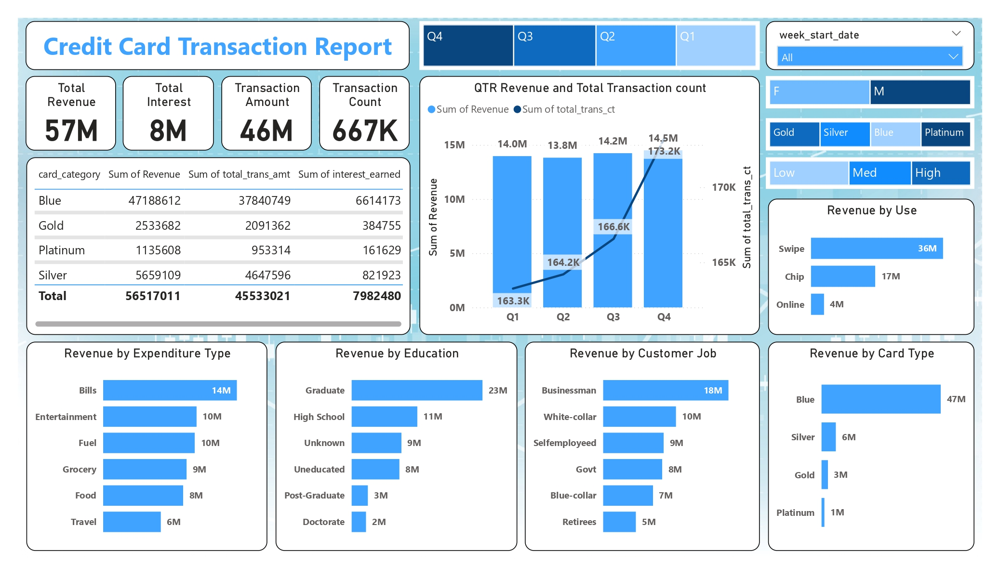
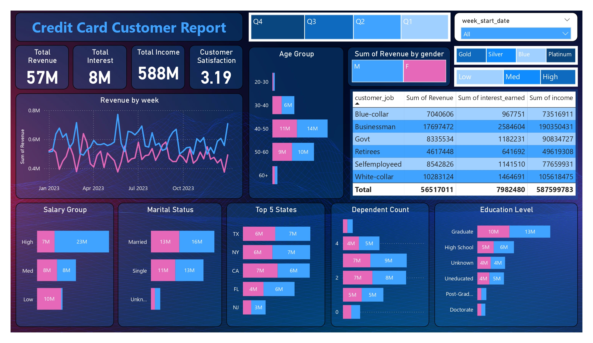

# 💳 Credit Card Weekly Dashboard

## 🎯 Project Objective
The goal of this project is to develop a comprehensive credit card weekly dashboard that provides **real-time insights** into key performance metrics and trends 📊. This dashboard enables stakeholders to effectively **monitor and analyze credit card operations** 🧐.

## 📊 Dashboard Overview

### 2️⃣ CC Transaction Report
A more detailed look into transaction data, segmented by various factors like customer demographics and card type.

### 1️⃣ CC Customer Report
This view showcases the key metrics such as revenue, transaction amounts, and customer statistics.

## 🛠️ Steps to Import Data to SQL Database

### 1️⃣ Prepare CSV File
📂 Ensure the data is organized and saved in a CSV format for easy import.

### 2️⃣ Create Tables in SQL
🗄️ Design and create the necessary tables in the SQL database.

### 3️⃣ Import CSV File into SQL
⚙️ Use appropriate SQL queries or database management tools to import the CSV data into the SQL tables.

---

## 📈 WoW (Week-over-Week) Change
- **📊 Revenue** increased by **28.8%** 📈
- **💸 Total Transaction Amount** & **🧮 Count** increased by **xx%** & **xx%**
- **👥 Customer count** increased by **xx%**

---

## 📅 YTD (Year-to-Date) Overview
- **💵 Overall revenue**: **$57M**
- **🏦 Total interest**: **$8M**
- **💳 Total transaction amount**: **$46M**
- **👨‍💼 Male customers** contribute more in revenue: **$31M**, **👩‍💼 Female**: **$26M**
- **🔵 Blue** & **🔘 Silver credit cards** account for **93%** of all transactions
- **🏙️ Top 3 contributing states**: **TX**, **NY**, and **CA** (68%)
- **⚙️ Overall Activation rate**: **57.5%**
- **🚨 Overall Delinquent rate**: **6.06%**

---

📊 Keep tracking your key metrics and stay ahead with real-time insights! 🚀
